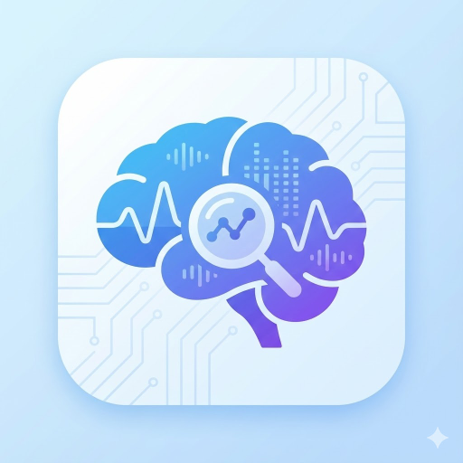

  

  # EEG Classifier

  **A Professional Desktop Suite for Offline EEG Signal Analysis**

  
  
  

  
  

    <a href="#features--algorithms">Features & Algorithms</a> •
    <a href="#tech-stack">Tech Stack</a> •
    <a href="#download--installation">Download</a> •
    <a href="#the-team">The Team</a>
  

---

## Overview

**EEG Classifier** is a robust, cross-platform desktop application designed for the preprocessing, analysis, and visualization of Electroencephalography (EEG) data. 

Unlike web-based tools, this application runs entirely **offline**, ensuring strict data privacy and leveraging the full performance of your local machine. It bridges the gap between modern UI design and powerful scientific computing, complete with local session tracking to manage your workflow securely.

---

## Features & Algorithms

We have implemented a robust library of signal processing and classification techniques powered by a specialized Python backend. The suite is designed to handle the complete analysis lifecycle:

* **Advanced Preprocessing:** A complete pipeline for signal conditioning, automated artifact removal, and adaptive filtering.
* **Feature Extraction & Spectral Analysis:** Tools for investigating frequency dynamics (PSD, Time-Frequency distributions) and deep analysis metrics like Differential Entropy.
* **Automated Classification:** Integrated deep learning inference (utilizing pre-trained CNN-LSTM and EEGNet models) for fast, automated signal classification.
* **Local Session History:** A secure, embedded local database that tracks and saves past analysis sessions, allowing you to review previous predictions and datasets without re-processing.

---

## Tech Stack

This project utilizes a **Hybrid Architecture** to combine the best of web technologies with scientific computing.

| Component | Technology | Description |
| :--- | :--- | :--- |
| **Frontend** |  | UI/UX, State Management, Visualization |
| **Backend** |  | FastAPI engine handling Scipy, MNE, and PyTorch inference |
| **Database** |  | Local session storage managed via Alembic migrations |
| **Wrapper** |  | Desktop integration and process orchestration |
| **CI/CD** |  | Automated multi-OS build and release pipeline |

---

## Download & Installation

We provide standalone installers for all major operating systems. No Python or Node.js installation is required.

### [Check All Releases and release notes](https://github.com/Eyad-Mostafa/EEG-Classifier-DesktopApp/releases/latest)

### Windows
1. Download from [here](https://github.com/Eyad-Mostafa/EEG-Classifier-DesktopApp/releases/latest/download/EEG.Classifier.exe)
2. Run the installer.
3. **Security Warning:** Since this is a university project, it is not digitally signed by Microsoft. 
   * If you see *"Windows protected your PC"*:
   * Click **More info** → Click **Run anyway**.

### macOS
1. Download from [here](https://github.com/Eyad-Mostafa/EEG-Classifier-DesktopApp/releases/latest/download/EEG.Classifier.dmg)
2. Drag the app to your Applications folder.
3. **Security Warning:** If you see *"App cannot be opened because the developer cannot be verified"*:
   * Right-Click the app icon → Select **Open** → Click **Open Anyway**.

### Linux
1. Download from [here](https://github.com/Eyad-Mostafa/EEG-Classifier-DesktopApp/releases/latest/download/EEG.Classifier.AppImage)
2. Right-click the file > Properties > Permissions > **Allow executing file as program**.
3. Double-click to run.

---

## The Team

This project was developed as a graduation project at Ain Shams University (Faculty of Science) for the 2025/2026 academic year.

| Name | GitHub |
| :--- | :--- |
| **Eyad Mostafa** | [@Eyad-Mostafa](https://github.com/Eyad-Mostafa) |
| **Abobaker Mohamed** | [@abobakerer](https://github.com/abobakerer) |
| **Menna-Allah Ahmed** | [@Menna-Allah-A](https://github.com/Menna-Allah-A) |
| **Omar Nasser** | [@omarnasser10](https://github.com/omarnasser10) |

 

**Under the supervision of:**
### Prof. [Mohamed Fakhry](https://github.com/m-fakhry)

---

  Built with ❤️ by the EEG Project Team • © 2025-2026

